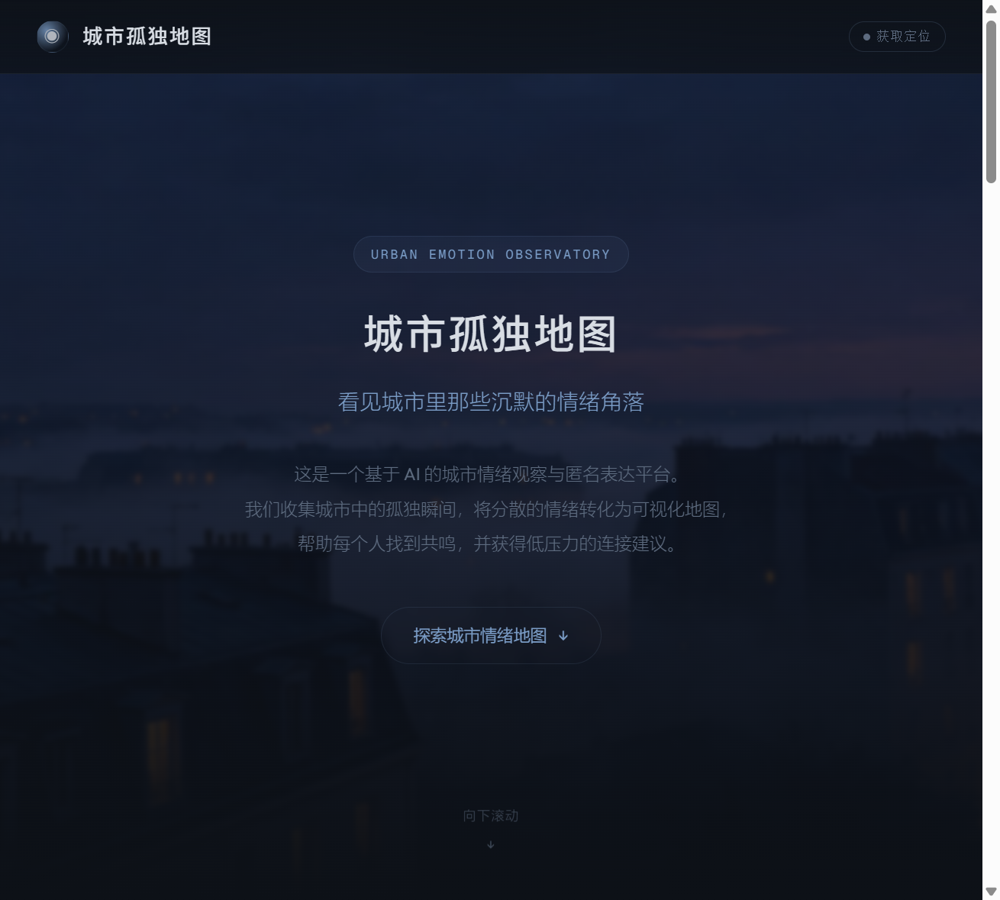
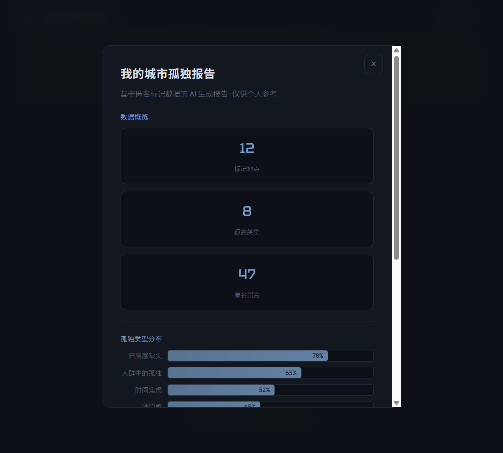

# 城市孤独地图 - 比赛提交材料

---

## Demo 简介

**城市孤独地图**是一个基于 AI 的城市情绪观察与匿名表达网页平台，面向城市中 18-35 岁的独居者、异地工作者、新城市移民等群体，核心功能包括匿名标记孤独地点、AI 情绪识别、城市孤独热力图可视化、附近在线用户低压力连接、地点小纸条留言以及个人城市孤独报告生成。

---

## 创作思路

### 灵感来源
末班地铁上沉默的乘客、凌晨两点便利店独自吃关东煮的背影、出租屋里只有冰箱嗡嗡声的深夜——城市化进程中，数以亿计的年轻人正在经历一种"身边有人却无人可说"的隐性孤独。这种孤独没有被充分看见，也缺乏安全、低压力的表达出口。我们希望通过一个不做心理治疗、不强迫社交的平台，让城市中的孤独者意识到：你不是一个人。

### 解决的痛点
- **社交软件要求实名关系**，朋友圈不敢发真实情绪
- **心理咨询门槛太高**，让人望而却步
- **孤独缺乏可视化表达**，人们不知道自己的感受是个体问题还是群体现象
- **现有社交产品压力太大**，匹配、匹配、聊天、加好友，反而加重焦虑

### 方向取舍
- **不做心理治疗软件**：定位为城市情绪观察平台，明确区分医疗与陪伴边界
- **不做匹配社交**：不做探探/Tinder 式的左右滑动，附近的人只展示距离和状态，对话按钮弱化，语音按钮作为更深层选项
- **不做高饱和科技蓝**：放弃了最初的霓虹赛博风格，最终选择雾蓝灰调的忧郁平静风格，像深夜开着灯的房间，安静而非冰冷
- **匿名优先**：所有留言默认匿名，小纸条没有署名，降低表达门槛

---

## 体验地址

**HTML 文件**（打包自包含，浏览器直接打开即可体验所有交互功能）：

[city-loneliness-map.html](computer://d:\map_demo\city-loneliness-map\city-loneliness-map.html)

完整项目目录：`d:\map_demo\city-loneliness-map\`

---

## TRAE 实践过程

### 步骤一：项目初始化与核心页面搭建

使用 TRAE 的 html-report 技能快速搭建项目脚手架，自动生成目录结构、引入 ECharts 和字体资源。通过自然语言描述需求"深蓝色城市夜景风格，科技感+人文感+孤独氛围"，TRAE 自动完成了页面骨架、Hero 区域、5 个核心功能卡片、城市地图 SVG 热力点、情绪档案面板的完整构建。

**Browser View ID**: `17fe93a7-9f94-415d-9b08-ed6866349441`

### 步骤二：功能迭代——定位、附近的人、聊天、小纸条

在第一版基础上，通过对话式交互让 TRAE 新增了地理定位按钮（调用浏览器 Geolocation API）、档案面板三标签页切换（情绪档案/附近的人/小纸条）、附近在线用户列表、实时聊天模态框（含模拟 AI 回复和语音通话状态）、小纸条留言墙等功能。TRAE 自主处理了标签切换逻辑、消息发送与模拟回复、纸条添加的 DOM 操作。

**Browser View ID**: `42f5add1-04bc-48df-b9a2-08a8751f4ff3`

### 步骤三：UI 重构——从科技蓝到忧郁平静

在用户反馈"太丑了，要有忧郁感、平静感"后，通过 GenerateImage 工具重新生成了薄暮雾中城市背景和水彩迷雾地图，然后让 TRAE 完整重写 CSS：主色调从高饱和科技蓝（#38bdf8）改为低饱和雾蓝（#7a9cc6），所有按钮从渐变实色改为透明描边，动画速度减半，字重变细，圆角变小，光晕减弱。TRAE 同时调整了文案语气，从"探索"改为更安静的表达。

### 步骤四：交互验证与细节打磨

使用 integrated_browser MCP 工具进行多轮页面预览与交互测试：验证地图热力点点击切换、标签页切换、聊天发送消息、小纸条提交、报告模态框弹出等核心交互链路。通过浏览器自动化点击和截图，快速定位布局问题并修复。

---

## 核心功能截图一览

| 功能 | 截图 |
|------|------|
| Hero 首屏 |  |
| 城市热力图+情绪档案 |  |
| 附近在线的人 |  |
| 地点小纸条墙 |  |
| AI 情绪分析体验 |  |
| 城市孤独报告 |  |
